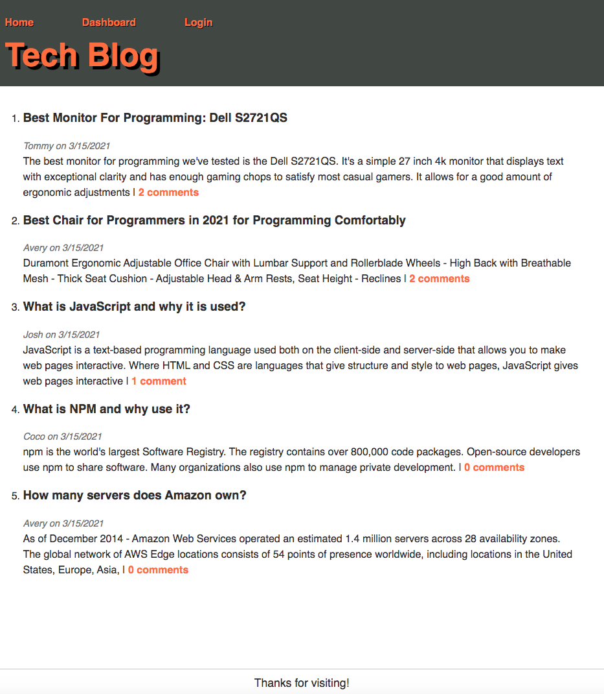
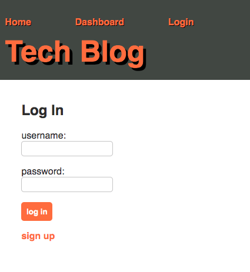
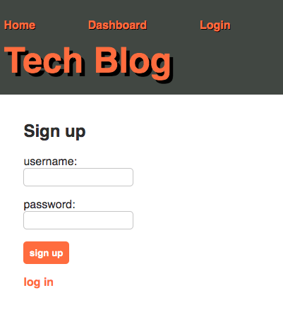
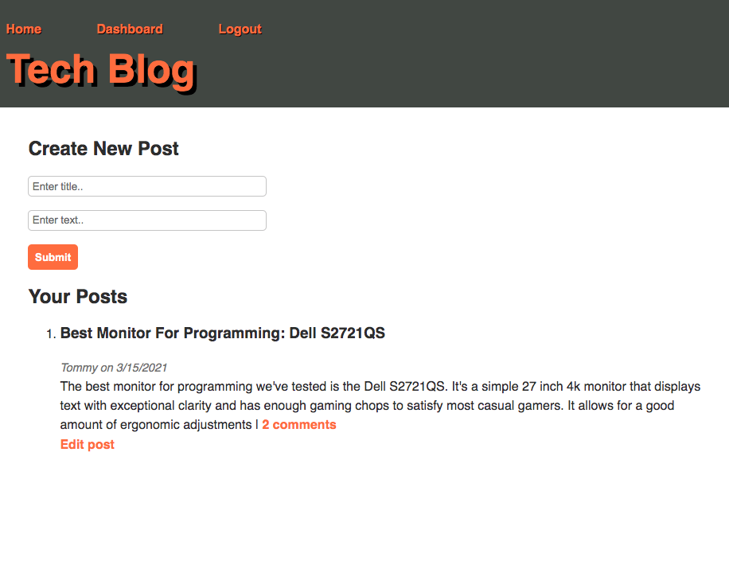
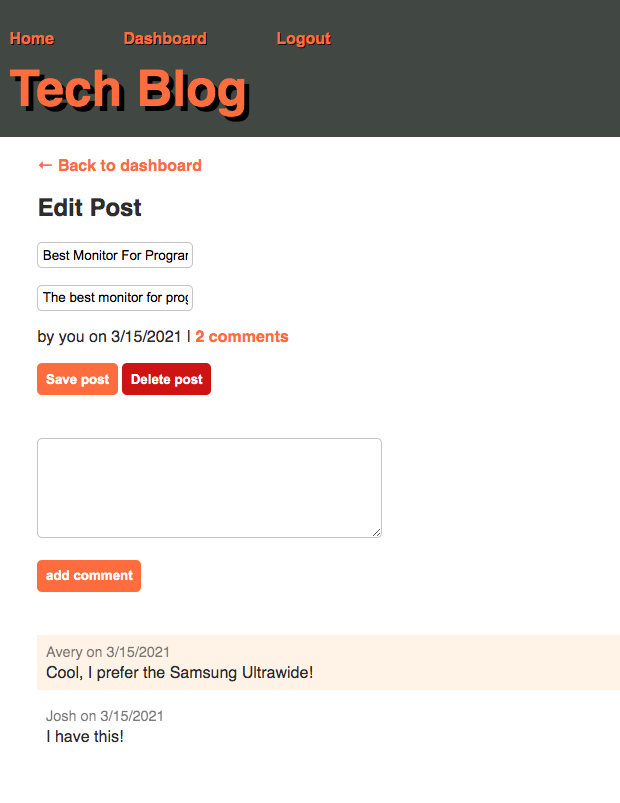

# Tech-Blog

## Table of Contents

1. [Description](#description)
2. [License](#license)
3. [Screenshots](#screenshots)
4. [Deployed-Url](#deployed-url)
5. [Questions](#questions)

### Description

AS A developer who writes about tech
I WANT a CMS-style blog site
SO THAT I can publish articles, blog posts, and my thoughts and opinions.

### License

This application is covered under the [MIT](https://opensource.org/licenses/MIT) license.

### Screenshots

Landing page:

Log in page, where user can also click on "sign up":

Sign up page, where user can also click on "log in":

Dashboard where user can view their own posts, create a new post or edit an existing post:

Edit post page, where user can delete or update post:

### Deployed-Url

[Click to view and use the application!](https://pacific-brook-34647.herokuapp.com/)

### Questions

Github Username: **Rajendra-Dhanraj**

[Click to follow and view my Github profile!](https://github.com/Rajendra-Dhanraj)

Alternatively, I can be contacted via email: **Rajendra.Dhanraj@gmail.com**
